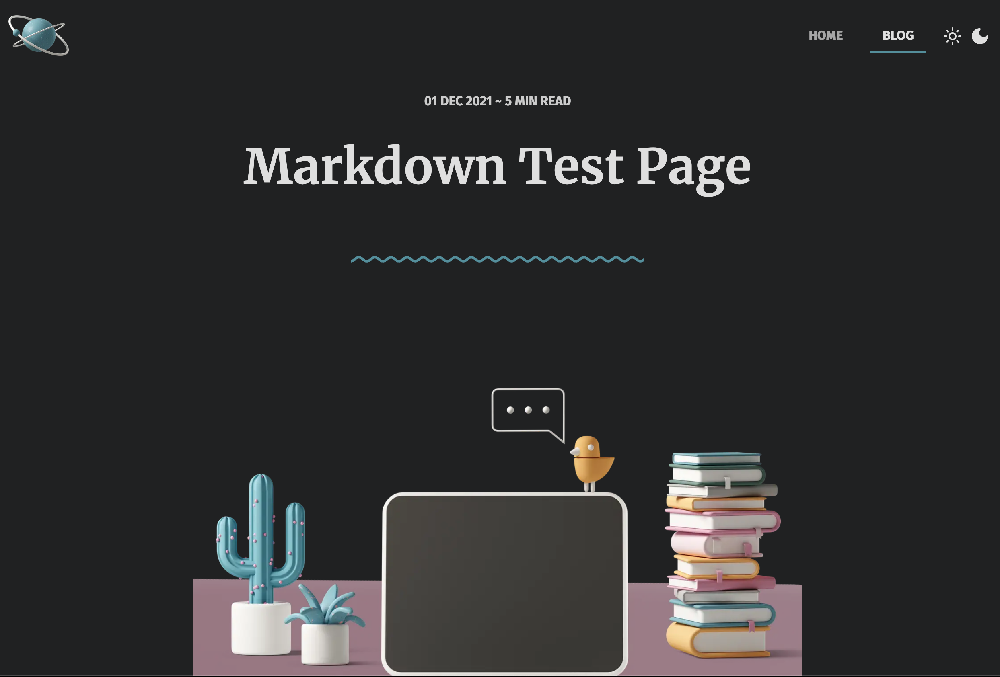

# Remix MDX Blog 🚀

A minimal remix blog built with the power of MDX and tailwindcss.

## 👉 Check out the ✨ [Live Demo](https://remix-mdx-blog-ten.vercel.app/) ✨

## 👩‍🚀 Description

Built with the Remix 1.14.0 and consists of:

- ✅ React 18
- ✅ Dark Mode with persistent theme-switching
- ✅ Remix route convention v2
- ✅ MDX files as their own routes (for code-splitting)
- ✅ Tailwindcss via Remix config
- ✅ Fully-responsive
- ✅ With Stagger animations from Framer-motion

## 🧞 Commands

All commands are run from the root of the project, from a terminal:

| Command         | Action                                      |
| :-------------- | :------------------------------------------ |
| `npm install`   | Installs dependencies                       |
| `npm run dev`   | Starts local dev server at `localhost:3000` |
| `npm run build` | Build your production site to `./build/`    |

## Contributing

Pull requests are welcome. For major changes, please open an issue first
to discuss what you would like to change.
